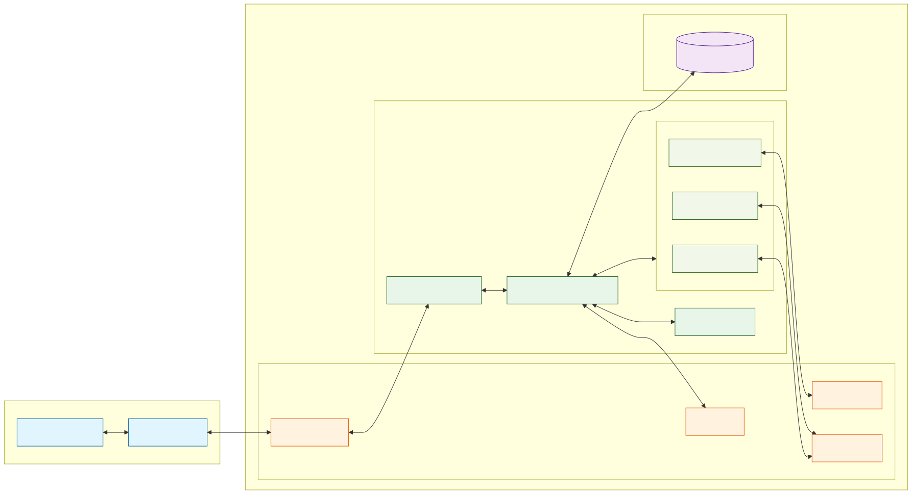

# AI Agent with Telegram

This project is a fully interactive AI-powered chatbot built with FastAPI and Telegram Bot API, designed to create realistic conversations. The AI agent can answer questions, provide information, and engage in dynamic, human-like dialogues.

## Features

- 🌐 **Telegram Integration:** Seamlessly connect with users through Telegram.
- ⚡ **FastAPI Backend:** High-performance API server.
- 🤖 **Realistic AI Conversations:** Powered by state-of-the-art AI models for engaging and accurate interactions.
- 🧠 **Context Awareness:** Maintains conversational context for a natural chat experience.

---

## Project Structure

```
.
├── app
│   ├── __init__.py
│   ├── config.example.py
│   ├── config.py
│   ├── conversation.py
│   ├── kokoro_tts
│   │   ├── __init__.py
│   │   └── tts.py
│   ├── main.py
│   ├── models.py
│   ├── prompts.py
│   ├── routes.py
│   ├── services
│   │   ├── __init__.py
│   │   ├── ai_service.py
│   │   └── telegram_service.py
│   └── tts_files
│       ├── kokoro-v1.0.onnx
│       └── voices-v1.0.bin

```

## System Design



---

## Installation

1. **Clone the repository:**

```bash
$ git clone https://github.com/yourusername/ai-agent-telegram.git
$ cd ai-agent-telegram
```

2. **Install dependencies with `uv`:**

To install the required dependencies for this project, use the following command with `uv`:

- First, ensure you have `uv` installed. If not, install it globally:

  ```bash
  pip install uv
  ```

- Then, install the dependencies using uv

```
uv install
```

3. **Download Kokoro model and voices:**

```
wget https://github.com/thewh1teagle/kokoro-onnx/releases/download/model-files-v1.0/kokoro-v1.0.onnx -P app/tts_files
wget https://github.com/thewh1teagle/kokoro-onnx/releases/download/model-files-v1.0/voices-v1.0.bin -P app/tts_files
```

For more information, please refer to the [kokoro-onnx](https://github.com/thewh1teagle/kokoro-onnx) repository.

4. **Set up your API keys:**

In the config.py file, provide your API tokens and keys:

```
# config.py
class Settings:
    TELEGRAM_TOKEN = "APII_TOKEN_HERE"
    TELEGRAM_API_BASE = f"https://api.telegram.org/bot{TELEGRAM_TOKEN}"
    OPENAI_API_KEY = "API_KEY"
    OPENAI_MODEL = "gpt-4o-mini"
    NOVITA_API_KEY = "API_KEY" # Optional, if you want to use Novita API
    NOVITA_API_URL = "https://api.novita.ai/v3beta/flux-1-schnell" # Optional, if you want to use Novita API
    GROQ_API_KEY = "API_KEY" # To be implemented :)
```

5. **Run the FastAPI server:**

```bash
$ uvicorn app.main:app --reload
```

6. **Set up your Telegram bot webhook:**

```bash
$ curl -F "url=https://your-server-url/webhook" https://api.telegram.org/bot<TELEGRAM_BOT_TOKEN>/setWebhook
```

---

## Usage

- Start a conversation with your bot on Telegram.
- The bot will respond with realistic, AI-generated replies.
- Enjoy a seamless chat experience with context-aware interactions.

---

## Roadmap

- [ ] Add support for multiple languages.
- [ ] Add support for vision based interactions.
- [ ] Implement Speech-to-Text (STT) for voice interactions.
- [ ] Implement user-specific conversation memory via a database.
- [ ] Integrate external APIs for enhanced responses.
- [ ] Enhance the user interface for a better user experience.

---

## Contributing

Contributions are welcome! Feel free to submit issues or pull requests.

---

## License

This project is licensed under the MIT License.
